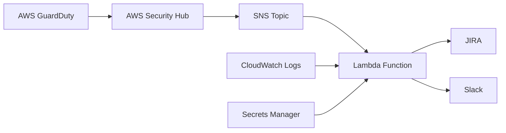

# AWS Security Alerting Pipeline

## Overview
This project implements a comprehensive AWS Security Alerting pipeline that integrates AWS GuardDuty and Security Hub findings with automated notifications to JIRA and Slack using AWS Lambda and SNS. The solution provides real-time security monitoring and incident response capabilities by seamlessly connecting AWS-native security tools with external ticketing and communication systems.

## Architecture


## Features
- Real-time security monitoring with AWS GuardDuty
- Centralized security findings management via Security Hub
- Automated alert routing through SNS
- Serverless processing with AWS Lambda
- Automated ticket creation in JIRA
- Instant notifications in Slack
- Secure credentials management with AWS Secrets Manager
- Comprehensive logging with CloudWatch

## Prerequisites
- AWS Account with administrative access
- JIRA account with API access
- Slack workspace with permissions to add webhooks
- Python 3.8 or later
- AWS CLI configured with appropriate credentials

## Components

### 1. AWS Services
- **GuardDuty**: Threat detection service that continuously monitors AWS accounts
- **Security Hub**: Security findings aggregator and compliance checker
- **Lambda**: Serverless compute service for alert processing
- **SNS**: Managed message pub/sub service
- **Secrets Manager**: Secure storage for API keys and credentials
- **CloudWatch**: Monitoring and logging service
- **IAM**: Identity and access management for secure service interactions

### 2. External Integrations
- **JIRA**: Issue tracking and project management
- **Slack**: Team communication and notifications

## Setup Instructions

### 1. AWS Services Configuration

#### Enable GuardDuty
```bash
aws guardduty create-detector --enable
```

#### Enable Security Hub
```bash
aws securityhub enable-security-hub
```

#### Create SNS Topic
```bash
aws sns create-topic --name SecurityAlerts
```

### 2. IAM Role Setup
Create an IAM role for Lambda with the following permissions:
- AWSLambdaBasicExecutionRole
- AmazonSNSFullAccess
- SecurityHubReadOnlyAccess
- GuardDutyReadOnlyAccess

### 3. Secrets Configuration
Store the following secrets in AWS Secrets Manager:
- JIRA API token
- JIRA instance URL
- Slack webhook URL

### 4. Lambda Function Deployment
Deploy the Lambda function using the provided code in `/src`

### 5. Integration Testing
Verify the pipeline by:
1. Generating a test GuardDuty finding
2. Confirming Security Hub receipt
3. Checking SNS message delivery
4. Validating JIRA ticket creation
5. Confirming Slack notification


## Security Considerations
- All credentials stored in AWS Secrets Manager
- Least privilege IAM roles
- Encrypted SNS topics
- VPC-enabled Lambda functions
- Regular security patches and updates
- Audit logging enabled

## Monitoring and Maintenance
- CloudWatch metrics and alarms
- Lambda function error tracking
- SNS delivery status monitoring
- Regular IAM policy reviews
- Automated backup procedures
